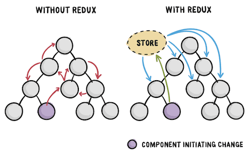

### package.json **dependencies** 목록

- "express": "^4.17.1",
- "mongoose": "^6.0.1"
- "body-parser": "^1.19.0"
- "cookie-parser": "^1.4.5",
  Http 통신은 Client의 요청(Request)이 있을 대만 서버가 응답(Response)하는 단방향 통신이다.

이 때, **body-parse**r는 Body 데이터를 분석(parse)해서 req.body로 출력한다.
**cookie-parser**는 쿠키를 쉽게 추출할 수 있도록 도와주는 미들웨어이다. req.cookies처럼 쿠키값을 확인할 수 있다.

### package.json **devDependencies** 목록

- "nodemon": "^2.0.12"

nodemon : 서버 관련하여 코드가 변경되었을 때, 서버를 중단하고 재시작하지 않아도 바로 변경한 부분이 실행될 수 있도록 도와준다.

### Postman

개발중에는 API Test Tool로는 Postman를 사용한다.

### config directory

DB정보가 담긴 url을 따로 dev.js로 저장하고, gitignore를 저장한다.

key.js에서 production모드일 때와 개발모드일 때를 분기한다.

(환경변수 process.env.NODE_ENV가 Local 환경에서 development를 가지고, 배포후에는 production을 가지므로 key.js에서 적절히 분기한다.)

### bcrypt, salt

- "bcrypt": "^5.0.1"

DB에 비밀번호를 암호화해서 저장하기 위해 bcrypt 라이브러리를 사용함.

[bcrypt npm 사이트 참고, Usage 부분](https://www.npmjs.com/package/bcrypt)

Register Route에서 유저정보를 DB에 저장하기 전에 암호화 로직을 작성한다.

User.js에서 saltRounds = 10으로, 10자리의 salt를 먼저 생성한다.

그리고 bcrypt의 genSalt로 salt를 생성해서 hash 비밀번호를 만든 뒤 암호화를 완료한다.

### jsonwebtoken

- "jsonwebtoken": "^8.5.1"

- npm에서 install

  npm install jsonwebtoken

- User.js에서 jwt로 토큰을 생성한다.

```javascript
var token = jwt.sign(user._id.toHexString()), 'secretToken')
user.token = token
```

user.\_id에 secretToken을 붙여서 Encode하여 token을 생성한다.

이 토큰을 Decode하면 seceretToken과 user.\_id를 알 수 있다.

### Auth

특정 페이지에 접근할 때 로그인 여부를 확인해야할 때가 있다. 또는 글을 수정하거나 지울 때, 작성자만이 할 수 있으므로 권한 체크가 필요하다.

토큰을 만든 후, 토큰을 유저정보에 넣어준다.

브라우저에서는 토큰을 쿠키에 저장했고, 서버에서는 DB의 User DB에 저장했다. 인증은 이 두 저장소를 비교해서 확인할 수 있다.

- 과정

만약 관리자가 아닌 유저가 관리자 페이지에 접근했다고 가정하자.

클라이언트에서는 쿠키에 저장된 토큰을 서버로 전송한다.

서버쪽으로 전달할 때, 토큰이 Encode된 상태니까 이것을 Decode해서 User ID를 찾아낸다.

서버에서 해당 User ID가 있는지 확인한다.

### Proxy 설정

client/src/setupProxy.js 생성

client에서 npm install http-proxy-middleware --save

https://create-react-app.dev/docs/proxying-api-requests-in-development

### Concurrently

client,server 동시에 켜서 작업하기 위해 npm install concurrently --save

https://www.npmjs.com/package/concurrent

# Redux

배경지식

### 1.Props

immutable

Properties의 shorts
부모 -> 자식

### 2.State

mutable

컴포넌트 안에서 데이터를 교환

State 변화시 reredering됨

## Redux

- Redux는 State을 관리한다.
- 

- 위의 그림의 왼쪽처럼, Redux를 사용하지 않으면 컴포넌트간 통신이 복잡해질 수 있다. 우측처럼 공통 저장소인 Store에 데이터를 저장하고 이와 통신하는 게 redux의 방식이다.

- 

- 위의 그림처럼, Redux은 단방향으로 흐른다.

  이 과정을 유명한 Redux gif를 보면서 이해해보자. [리덕스 공식문서](https://redux.js.org/tutorials/essentials/part-1-overview-concepts)


- Action : 무엇이 일어났는지 설명하는 단계
- Reducer : Action으로 인해, state가 어떻게 변하는지. 이전 state와 action object를 받은 후에 next state를 return함.
- Store : state을 감싸준다. state를 관리하기 위한 여러 method가 있다.


## redux middleware

- 설치 cmd : npm install redux react-redux **redux-promise redux-thunk** --save

- 배경
  - Action : **a plain object** describing what happened. 즉, Action은 객체 형식이어야함. 그러나 Store에서는 언제나 객체형식의 Actions을 받는 게 아니라, **Promise**나 **Funcitons**형태를 받을 때도 있다. 

### redux-promise

Promise 형식의 Actions를 받기 위해 사용

### redux-thunk

Functions 형식의 Actions를 받기 위해 사용


